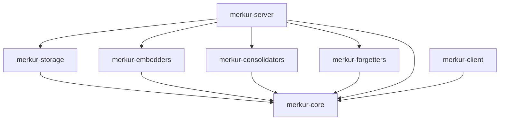
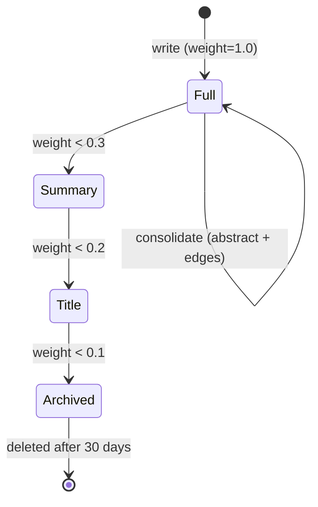
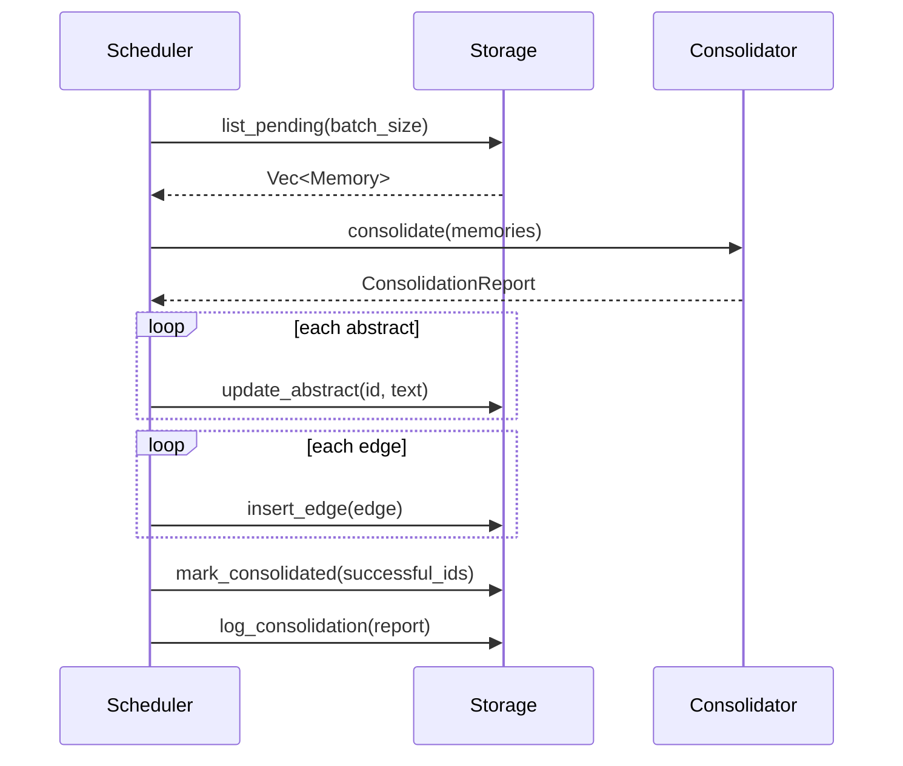

# MerkurDB — Architecture

> [中文版](ARCHITECTURE_CN.md) · v0.3.0

## Crate Structure & Dependencies

```
crates/
├── core/                # Types, traits, errors — zero deps (pure definitions)
├── storage/             # SqliteStorage + LanceDbStorage
├── embedders/           # NoopEmbedder + OllamaEmbedder + OpenAIEmbedder
├── consolidators/       # NoopConsolidator + LlmConsolidator
├── forgetters/          # EbbinghausForgetter
├── server/              # axum HTTP server + Scheduler
└── client/              # Rust SDK (MerkurClient trait + HttpMerkurClient)
```

**Dependency direction**: `core` ← all crates, `server` depends on all crates, `client` depends only on `core`.



## Plugin Trait System

Four core traits, injected via configuration, independently replaceable:

```rust
#[async_trait]
pub trait Embedder: Send + Sync {
    fn dim(&self) -> usize;
    async fn encode(&self, text: &str) -> MerkurResult<Vec<f32>>;
    async fn encode_batch(&self, texts: &[String]) -> MerkurResult<Vec<Vec<f32>>>;
}

#[async_trait]
pub trait Consolidator: Send + Sync {
    // Returns a report; the Scheduler applies it — decoupled from Storage
    async fn consolidate(&self, memories: &[Memory]) -> MerkurResult<ConsolidationReport>;
}

pub trait Forgetter: Send + Sync {
    fn compute_weight(&self, memory: &Memory, now: DateTime<Utc>) -> f64;
    // `now` is explicit for deterministic testing
    fn decide(&self, memory: &Memory, now: DateTime<Utc>) -> LevelAction;
}

#[async_trait]
pub trait Storage: Send + Sync {
    async fn insert_memory(&self, mem: &NewMemory) -> MerkurResult<String>;
    async fn update_memory(&self, id: &str, content: &str, embedding: Option<&[f32]>) -> MerkurResult<()>;
    async fn get_memory(&self, id: &str) -> MerkurResult<Option<Memory>>;
    async fn delete_memory(&self, id: &str) -> MerkurResult<()>;
    async fn vector_search(&self, vec: &[f32], limit: usize) -> MerkurResult<Vec<ScoredMemory>>;
    async fn insert_edge(&self, edge: &NewEdge) -> MerkurResult<()>;
    async fn get_edges(&self, memory_id: &str) -> MerkurResult<Vec<Edge>>;
    async fn get_edges_batch(&self, memory_ids: &[String]) -> MerkurResult<HashMap<String, Vec<Edge>>>;
    async fn memory_exists_batch(&self, ids: &[String]) -> MerkurResult<HashSet<String>>;
    async fn update_abstract(&self, id: &str, abstract_: &str) -> MerkurResult<()>;
    async fn bfs_expand(&self, seed_ids: &[String], depth: usize, degree_limit: usize) -> MerkurResult<Vec<ScoredMemory>>;
    async fn list_pending(&self, limit: usize) -> MerkurResult<Vec<Memory>>;
    async fn list_for_forgetting(&self, limit: usize) -> MerkurResult<Vec<Memory>>;
    async fn mark_consolidated(&self, ids: &[String]) -> MerkurResult<()>;
    async fn update_level(&self, id: &str, level: i32) -> MerkurResult<()>;
    async fn delete_archived_older_than(&self, days: i32) -> MerkurResult<usize>;
    async fn log_consolidation(&self, started_at: DateTime<Utc>, finished_at: DateTime<Utc>, report: &ConsolidationReport) -> MerkurResult<()>;
    async fn get_consolidation_log(&self, limit: usize) -> MerkurResult<Vec<ConsolidationLogEntry>>;
    async fn stats(&self) -> MerkurResult<StorageStats>;
}
```

## Data Model

```rust
pub struct Memory {
    pub id: String,
    pub content: String,
    pub abstract_: Option<String>,
    pub category: String,
    pub weight: f64,           // forgetting curve weight
    pub level: MemoryLevel,    // Full=2 | Summary=1 | Title=0 | Archived=-1
    pub pending_consolidation: bool,
    pub embedding: Option<Vec<f32>>,
    pub metadata: HashMap<String, serde_json::Value>,
    pub context: HashMap<String, String>,
    pub created_at: DateTime<Utc>,
    pub updated_at: DateTime<Utc>,
    pub accessed_at: DateTime<Utc>,
    pub access_count: u64,
}

pub struct Edge {
    pub id: i64,
    pub source_id: String,
    pub target_id: String,
    pub weight: f64,
    pub relation: String,
    pub edge_type: EdgeType,    // Auto (BFS bidirectional) | Manual (BFS directed)
}
```

## Storage Layer

### SqliteStorage (default)
- **Metadata**: SQLite, WAL mode, r2d2 connection pool (max 10)
- **Vector index**: `InMemoryVectorIndex` — `parking_lot::RwLock`, parallel arrays (ids/vectors/norms) + HashMap index, O(n log k) top-k cosine search with pre-cached L2 norms
- **Startup**: Loads all vectors from `embedding BLOB` column into memory
- **Tables**: memories, edges, context_tags, consolidate_log (8 indexes)

### LanceDbStorage (feature gated)
- **Metadata**: SQLite (same DDL as SqliteStorage)
- **Vectors**: LanceDB disk storage, auto-builds IVF index once table exceeds 256 rows
- **Search**: LanceDB `nearest_to` query, L2 distance → cosine similarity approximation (`1 - d²/2`)
- **Requires**: `protoc` (build-only), `--features lancedb`

### Shared SQL Logic
`sqlite_helpers.rs` — 12 shared functions (insert_edge, bfs_expand, search_by_context, stats, etc.), eliminating ~530 lines of duplication across both backends.

## Retrieval System


### S1 Fast — Vector Search
`Embedder::encode()` → `InMemoryVectorIndex::search()` cosine top-k → SQLite metadata enrichment

### S2 Deep — Graph Diffusion
S1 seeds → SQLite CTE BFS (recursive WITH RECURSIVE, path-based cycle detection):
```sql
WITH RECURSIVE bfs(id, d, w, path) AS (
    SELECT value, 0, 1.0, value FROM json_each('["seed1","seed2"]')
    UNION
    SELECT CASE WHEN e.source_id=bfs.id THEN e.target_id ELSE e.source_id END,
           bfs.d+1, bfs.w*e.weight,
           bfs.path||','||...
    FROM bfs JOIN edges e ON (auto bidirectional OR manual directed)
    WHERE bfs.d < {depth} AND path NOT LIKE '%'||...||'%'
)
SELECT ... FROM bfs JOIN memories m WHERE bfs.d>0 AND m.level>=0
```

## Cognitive Pipeline



### Forgetting Curve (EbbinghausForgetter)
```
w(t) = w₀ · exp(-Δt · ln2 / h) · min(1 + β · log₂(1 + n), 3.0)
```
- h: half_life_seconds (86400s), β: access_boost (0.1), n: access_count
- Access bonus capped at 3.0× to prevent immortal memories
- Downgrade thresholds: Full→Summary (w<0.3), Summary→Title (w<0.2), Title→Archive (w<0.1)
- `access_count` auto-increments on every `get_memory` call

### Consolidation



1. Scheduler scans `pending_consolidation=1` memories
2. Consolidator analyzes → returns `ConsolidationReport` (abstracts + edges)
3. Scheduler applies results: update_abstract + insert_edge + mark_consolidated (only successful ids)
4. Writes `consolidate_log` audit entry

## Configuration

```yaml
server:
  host: "127.0.0.1"
  port: 1934

storage:
  type: "sqlite"          # sqlite | lancedb
  sqlite:
    path: "~/.merkur/data/merkur.db"

plugins:
  embedder:
    type: "noop"           # noop | ollama | openai
    noop: { dim: 384 }

consolidation:
  interval_seconds: 60
  batch_size: 10

forgetting:
  interval_seconds: 300
  batch_size: 100
  archive_days: 30
  decay_factor: 0.9
  half_life_seconds: 86400
  access_boost: 0.1
  threshold_to_l1: 0.3
  threshold_to_l0: 0.2
  threshold_archive: 0.1

retrieval:
  fast_default_limit: 10
  score_threshold: 0.3
```

Environment variable override: `MERKUR_` prefix. Priority: env > config.yaml > defaults.

## API Endpoints

| Method | Path | Description |
|--------|------|-------------|
| `GET` | `/v1/health` | Health check |
| `POST` | `/v1/write` | Write a memory |
| `POST` | `/v1/write-batch` | Batch write (partial success returned) |
| `GET` | `/v1/search` | Search with level/category/date/include_graph filters |
| `GET` | `/v1/memory/{id}` | Get memory (auto-increments access_count) |
| `PUT` | `/v1/memory/{id}` | Update content (auto re-embed + mark pending) |
| `DELETE` | `/v1/memory/{id}` | Cascade delete (edges + tags + vectors) |
| `GET` | `/v1/status` | Storage stats + uptime |
| `POST` | `/v1/consolidate` | Trigger consolidation |
| `GET` | `/v1/consolidate/log` | Consolidation audit trail |
| `POST` | `/v1/relate` | Create edge |
| `POST` | `/v1/relate-batch` | Batch create edges |
| `POST` | `/v1/forget` | Trigger forgetting evaluation |
| `GET` | `/v1/graph/{id}` | Graph neighborhood with edge details |

Error format: `{"error": {"code": "...", "message": "..."}}`

All endpoints except `/v1/health` require `Authorization: Bearer <token>`. Token comparison uses the `subtle` crate for constant-time equality.

## Feature Gates

| Feature | Requires | Backend |
|---------|----------|---------|
| `ollama` (default) | reqwest | OllamaEmbedder |
| `openai` | reqwest | OpenAIEmbedder |
| `lancedb` | lancedb + arrow + protoc | LanceDbStorage |

```bash
cargo build --features openai,lancedb
```

## Technology Stack

| Layer | Choice | Rationale |
|-------|--------|-----------|
| HTTP | axum 0.8 | Tokio ecosystem, async |
| SQLite | rusqlite 0.32 (bundled) | Zero system deps |
| Vectors (v0) | In-memory FAISS-like | OK for <10K vectors |
| Vectors (v1) | LanceDB 0.27 | Disk storage, auto-index after 256 rows |
| Serialization | serde + serde_json | Rust standard |
| Config | figment 0.10 | Multi-layer merge |
| Logging | tracing | Structured |
| Errors | thiserror 2 | Derive macro |
| SDK | OpenAPI 3.0 + Rust trait | Multi-language generation |
| Deployment | Single 8MB binary + Docker | Zero runtime deps |

## Project Scale

```
7 crates · 31 Rust source files · ~6,400 lines
41 tests · 0 clippy warnings
14 API endpoints · 3 feature flags
```
