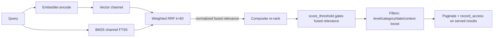
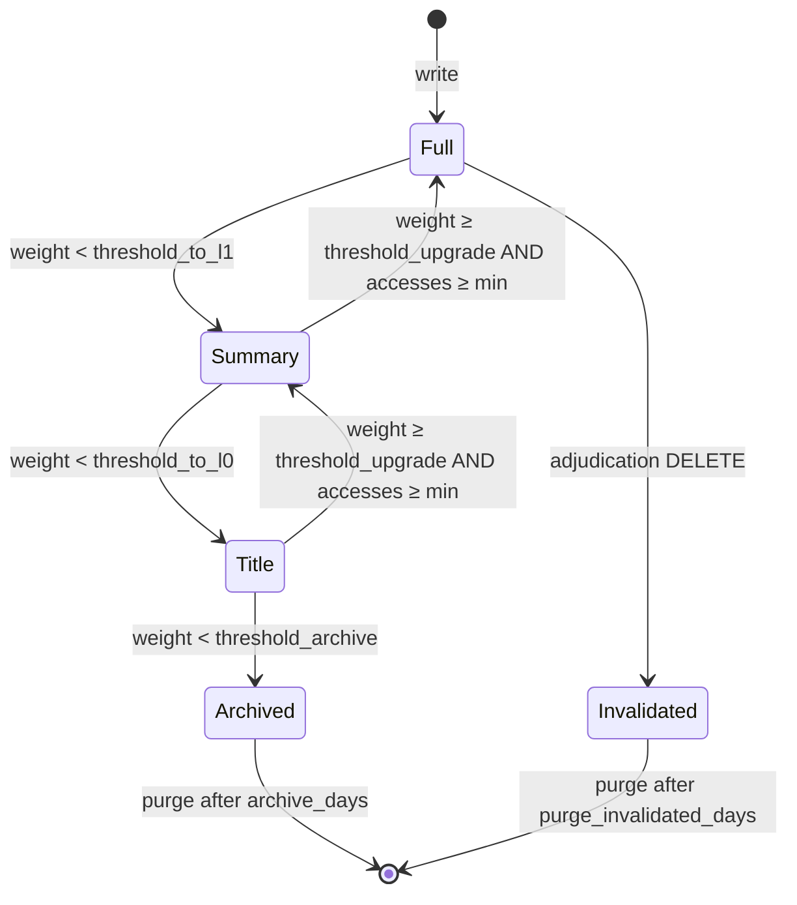
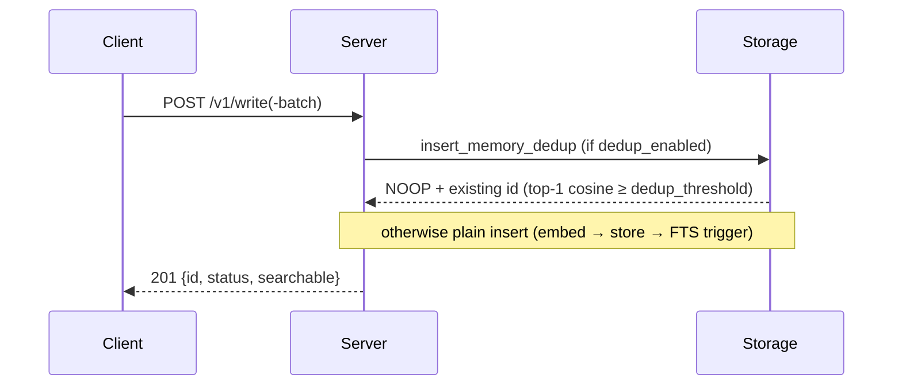

# MerkurDB — Architecture

> [中文版](ARCHITECTURE_CN.md) · Interactive diagram: [diagrams/architecture.html](diagrams/architecture.html)

## Crate Structure & Dependencies

```
crates/
├── core/                # Types, traits, errors, fusion/scoring logic — zero deps
├── storage/             # SqliteStorage + LanceDbStorage (feature-gated)
├── embedders/           # NoopEmbedder + OllamaEmbedder + OpenAIEmbedder
├── consolidators/       # NoopConsolidator + LlmConsolidator
├── forgetters/          # EbbinghausForgetter
├── server/              # axum HTTP server + Scheduler (consolidation/forgetting ticks)
├── client/              # Rust SDK (MerkurClient trait + HttpMerkurClient)
├── cli/                 # merkurctl admin CLI
├── mcp/                 # merkur-mcp: MCP server over stdio
└── eval/                # merkur-eval: LoCoMo + PersonaMem benchmark harness
```

**Dependency direction**: everything depends on `core`; `server` composes storage + plugins; `mcp` depends on core/storage/embedders; `eval` depends on `client` (drives the server over HTTP); `cli` and `client` depend only on `core` (+ HTTP).

## Plugin Trait System

Four traits, injected via configuration, independently replaceable:

| Trait | Implementations | Notes |
|---|---|---|
| `Embedder` | Noop, Ollama, OpenAI-compatible | `dim()` probed from the backend at boot; storage adapts |
| `Storage` | SqliteStorage, LanceDbStorage | full read/write surface: memories, edges, FTS5 text search, namespaced vector search, BFS expand, consolidation bookkeeping, soft-invalidation, `record_access`, batch embedding fetch |
| `Consolidator` | Noop, LLM (Ollama or OpenAI-compatible, optional bearer + timeout) | `consolidate()` produces abstracts/importance/edges; `adjudicate()` produces ADD/UPDATE/DELETE/NOOP verdicts |
| `Forgetter` | Ebbinghaus | `compute_weight` + `decide` (downgrade/archive/upgrade) |

The authoritative surface is `crates/core/src/traits.rs`; implement at the trait, configure in `config.rs`, wire in `main.rs`, document in `config.example.yaml`.

## Data Model

`Memory` (schema v5):

| Field group | Fields | Notes |
|---|---|---|
| identity | `id` | system-generated |
| content | `content`, `abstract_` | `abstract_` written only by the Consolidator |
| salience | `weight`, `importance`, `access_count`, `accessed_at` | `weight` is decayed by the forgetting curve; `importance` is Consolidator-assessed (never client-reported); access recorded at serving points only |
| classification | `category`, `level` (Full=2 / Summary=1 / Title=0 / Archived=-1), `context`, `metadata` | |
| tenancy | `namespace` | every retrieval path is bucket-scoped |
| temporality | `created_at`, `updated_at`, `valid_at`, `invalid_at` | `valid_at` backfilled from `created_at`; `invalid_at` set = soft-invalidated (hidden from retrieval, auditable until purged) |
| consolidation | `pending_consolidation`, `embedding` | |

`Edge`: `source_id`/`target_id`/`weight`/`relation`/`edge_type` (System = LLM-created, bidirectional in BFS; Manual = client-created, directed).

## Storage Layer

### SqliteStorage (default)
- **Metadata**: SQLite, WAL mode, r2d2 connection pool
- **Vector index**: `InMemoryVectorIndex` — `parking_lot::RwLock`, parallel arrays + HashMap, O(n log k) top-k with pre-cached L2 norms
- **Tables**: `memories`, `edges`, `context_tags`, `consolidate_log`, `memories_fts` (FTS5, trigger-synced with every write path), `merkur_meta` (schema version)
- **Migrations**: per-version, transactional, replay-safe; a partially migrated database self-heals on boot

### LanceDbStorage (feature `lancedb`)
- **Metadata**: SQLite (same DDL, same migrations)
- **Vectors**: LanceDB disk storage, auto-builds IVF index past 256 rows
- **Requires**: `protoc` (build-only), `--features lancedb`

### Shared SQL Logic
`sqlite_helpers.rs` — both backends share row projection (`get_memory_row`), batch embedding fetch, BFS, and write paths through one set of functions so the two backends cannot drift.

## Retrieval System

Three modes on `GET /v1/search`:

| Mode | Path | Score semantics |
|---|---|---|
| `hybrid` (default) | BM25 (FTS5 trigram) + vector cosine, both oversampled, fused via RRF, then re-ranked by composite | composite = `score_search·fused + score_weight·weight + score_importance·importance` |
| `fast` | vector top-k | raw cosine |
| `deep` | fast seeds → CTE BFS graph diffusion | `0.5^depth × path weight` |


```mermaid
flowchart LR
    Q[Query] --> E[Embedder.encode]
    E --> V[Vector channel]
    Q --> B[BM25 channel FTS5]
    V --> RRF[Weighted RRF k=60]
    B --> RRF
    RRF -->|normalized fused relevance| C[Composite re-rank]
    C --> TH[score_threshold gates fused relevance]
    TH --> F[Filters: level/category/date/context boost]
    F --> P[Paginate + record_access on served results]
```

Fusion knobs live under `retrieval.fusion.*` (`rrf_k`, channel weights, composite shares) — env-overridable as `MERKUR_RETRIEVAL__FUSION__*`.

**Access signal discipline**: retrieval methods are pure (no side effects); `record_access` is called only by serving points (search handler, `/v1/context`, MCP `search_memory`) for the results actually served.

## Cognitive Pipeline

### Lifecycle


```mermaid
stateDiagram-v2
    [*] --> Full: write
    Full --> Summary: weight < threshold_to_l1
    Summary --> Title: weight < threshold_to_l0
    Title --> Archived: weight < threshold_archive
    Summary --> Full: weight ≥ threshold_upgrade AND accesses ≥ min
    Title --> Summary: weight ≥ threshold_upgrade AND accesses ≥ min
    Archived --> [*]: purge after archive_days
    Full --> Invalidated: adjudication DELETE
    Invalidated --> [*]: purge after purge_invalidated_days
```

- Weight: `w(t) = w₀ · exp(-Δt·ln2/h) · min(1 + β·log₂(1+n), 3.0)` — `h = half_life_seconds`, `β = access_boost`, `n = access_count`
- Promotion is hysteresis-gated (`threshold_upgrade` must exceed `threshold_to_l1`; both weight bar and access-count bar required), so a hot memory climbs back without oscillation
- Soft-invalidation (`invalid_at`) is the system-only removal channel; client `DELETE` remains an immediate hard delete

### Write path


```mermaid
sequenceDiagram
    participant C as Client
    participant S as Server
    participant D as Storage

    C->>S: POST /v1/write(-batch)
    S->>D: insert_memory_dedup (if dedup_enabled)
    D-->>S: NOOP + existing id (top-1 cosine ≥ dedup_threshold) 
    Note over S,D: otherwise plain insert (embed → store → FTS trigger)
    S-->>C: 201 {id, status, searchable}
```

Dedup probes are read-only (no access-signal pollution); on probe error the write falls back to a plain insert.

### Consolidation tick

```mermaid
sequenceDiagram
    participant S as Scheduler
    participant D as Storage
    participant L as Consolidator (LLM)

    S->>D: list_pending(batch_size)
    S->>L: consolidate(pending)
    L-->>S: abstracts + importance + edges
    S->>D: update_abstract / update_importance / insert_edge
    S->>D: mark_consolidated(succeeded ids only)
    S->>D: log_consolidation(report)
    rect rgb(40, 40, 40)
        Note over S,L: adjudication phase (adjudication_candidates > 0)
        S->>D: get_embeddings(pending) + vector_search_ns (same-bucket candidates)
        S->>L: adjudicate(pending, candidates)
        L-->>S: ADD/UPDATE/DELETE/NOOP per memory
        S->>D: execute only if cosine ≥ adjudication_floor
        Note over S,D: UPDATE absorbs in place (absorbed_into audit pointer);<br/>DELETE sets invalid_at; anything unparseable collapses to ADD
    end
```

## Configuration

Precedence: `--config YAML` > `MERKUR_*` env vars (`__` as level separator) > built-in defaults. Startup validation rejects contradictory or out-of-range values (threshold ordering, dedup/fusion ranges, reserved keys).

Full annotated example: [`config.example.yaml`](../config.example.yaml). Sections: `server` (host/port/cors/dev_mode) · `storage` (sqlite/lancedb) · `plugins.embedder` (noop/ollama/openai) · `plugins.consolidator` (noop/llm + backend/api_key/timeout_seconds) · `retrieval` (limits, threshold, `fusion.*`) · `auth` (tokens/disabled) · `consolidation` (interval/batch/adjudication_floor/candidates) · `forgetting` (decay/thresholds/promotion/purge windows) · `write` (dedup) · `logging` · `rate_limit`.

## API Surface

16 routes under `/v1` (OpenAPI: [`openapi.yaml`](../openapi.yaml) is the contract of record):

- Public: `GET /health`, `GET /metrics` (Prometheus)
- Write: `POST /write`, `POST /write-batch`
- Read: `GET /search`, `POST /context`, `GET /memory/{id}`, `GET /graph/{id}`, `GET /status`
- Lifecycle: `POST /consolidate`, `GET /consolidate/log`, `POST /forget`
- Graph: `POST /relate`, `POST /relate-batch`

Auth: `Authorization: Bearer <token>` (constant-time comparison); `X-Merkur-Namespace` scopes write/search/context/graph to one bucket (logical isolation, not a security boundary). Error envelope: `{"error": {"code", "message"}}`; notable codes — 401 UNAUTHORIZED, 429 RATE_LIMITED, 502 EMBED_FAILED, 207 on all-failed write-batch.

## Feature Gates

| Feature | Requires | Effect |
|---------|----------|--------|
| `ollama` (default) | reqwest | OllamaEmbedder |
| `openai` | reqwest | OpenAIEmbedder (+ consolidator OpenAI backend) |
| `lancedb` | lancedb + arrow + protoc | LanceDbStorage |

## Technology Stack

| Layer | Choice | Rationale |
|-------|--------|-----------|
| HTTP | axum 0.8 | Tokio ecosystem, async |
| SQLite | rusqlite (bundled) | Zero system deps |
| Vectors | In-memory index; LanceDB feature | OK for <10K vectors; disk + IVF beyond |
| Serialization | serde + serde_json | Rust standard |
| Config | figment | YAML + env layered merge |
| Logging | tracing | Structured |
| Errors | thiserror | Derive macro |
| Deployment | Single binary + Docker | Zero runtime deps |
