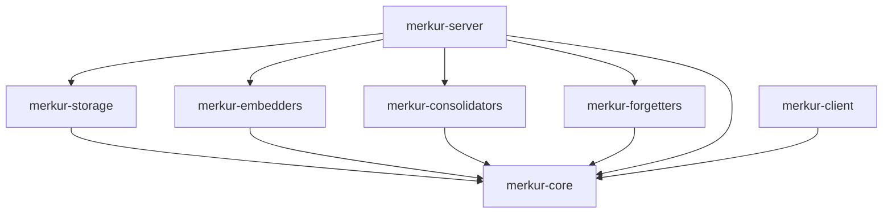
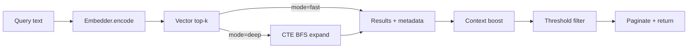
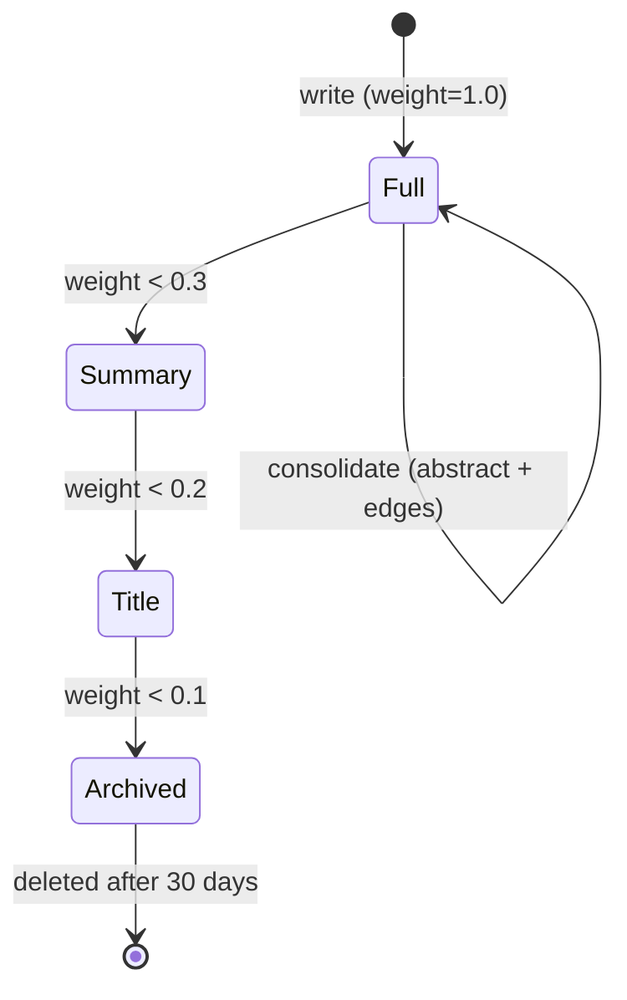
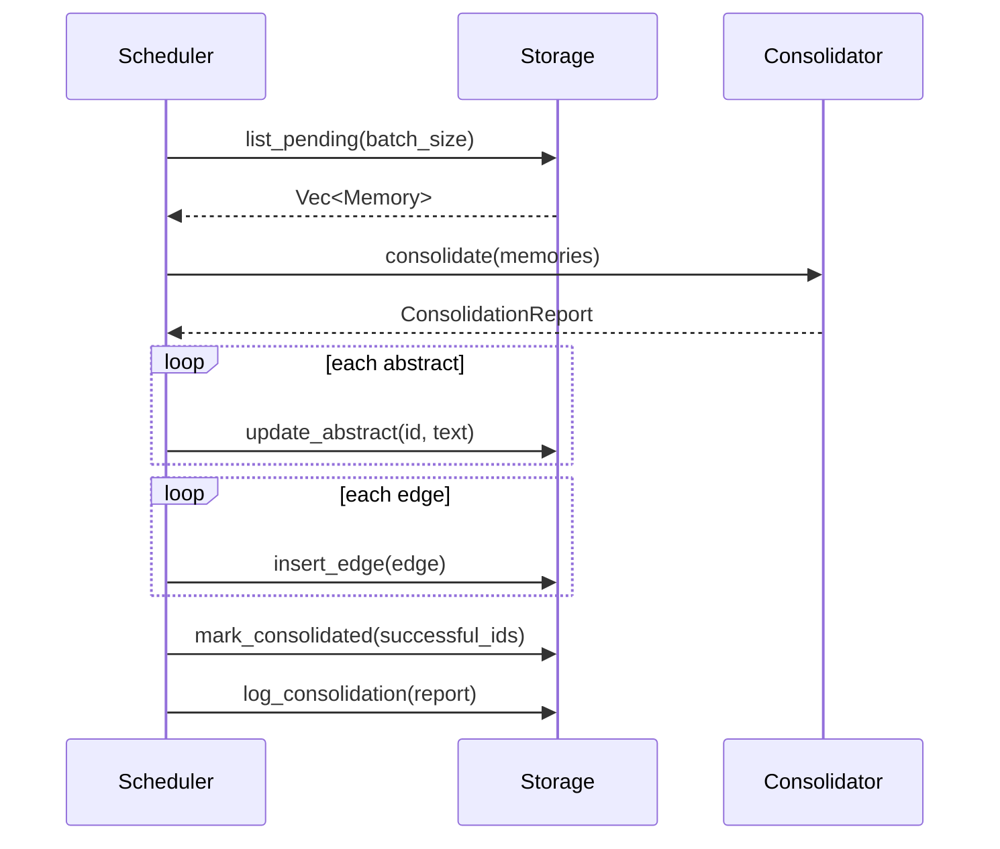

# MerkurDB — 技术架构

> [English](ARCHITECTURE.md) · v0.3.0

## Crate 结构与依赖

```
crates/
├── core/                # 类型、trait、错误 — 零外部依赖（纯定义）
├── storage/             # SqliteStorage + LanceDbStorage
├── embedders/           # NoopEmbedder + OllamaEmbedder + OpenAIEmbedder
├── consolidators/       # NoopConsolidator + LlmConsolidator
├── forgetters/          # EbbinghausForgetter
├── server/              # axum HTTP 服务 + Scheduler
└── client/              # Rust SDK (MerkurClient trait + HttpMerkurClient)
```

**依赖方向**：`core` ← 所有 crate，`server` 依赖所有 crate，`client` 仅依赖 `core`。



## 插件 Trait 系统

四个核心 trait，通过配置注入，可独立替换：

```rust
#[async_trait]
pub trait Embedder: Send + Sync {
    fn dim(&self) -> usize;
    async fn encode(&self, text: &str) -> MerkurResult<Vec<f32>>;
    async fn encode_batch(&self, texts: &[String]) -> MerkurResult<Vec<Vec<f32>>>;
}

#[async_trait]
pub trait Consolidator: Send + Sync {
    // 返回报告；Scheduler 负责应用 — 与 Storage 解耦
    async fn consolidate(&self, memories: &[Memory]) -> MerkurResult<ConsolidationReport>;
}

pub trait Forgetter: Send + Sync {
    fn compute_weight(&self, memory: &Memory, now: DateTime<Utc>) -> f64;
    // `now` 显式传入以支持确定性测试
    fn decide(&self, memory: &Memory, now: DateTime<Utc>) -> LevelAction;
}

#[async_trait]
pub trait Storage: Send + Sync {
    async fn insert_memory(&self, mem: &NewMemory) -> MerkurResult<String>;
    async fn update_memory(&self, id: &str, content: &str, embedding: Option<&[f32]>) -> MerkurResult<()>;
    async fn get_memory(&self, id: &str) -> MerkurResult<Option<Memory>>;
    async fn delete_memory(&self, id: &str) -> MerkurResult<()>;
    async fn vector_search(&self, vec: &[f32], limit: usize) -> MerkurResult<Vec<ScoredMemory>>;
    async fn insert_edge(&self, edge: &NewEdge) -> MerkurResult<()>;
    async fn get_edges(&self, memory_id: &str) -> MerkurResult<Vec<Edge>>;
    async fn get_edges_batch(&self, memory_ids: &[String]) -> MerkurResult<HashMap<String, Vec<Edge>>>;
    async fn memory_exists_batch(&self, ids: &[String]) -> MerkurResult<HashSet<String>>;
    async fn update_abstract(&self, id: &str, abstract_: &str) -> MerkurResult<()>;
    async fn bfs_expand(&self, seed_ids: &[String], depth: usize, degree_limit: usize) -> MerkurResult<Vec<ScoredMemory>>;
    async fn list_pending(&self, limit: usize) -> MerkurResult<Vec<Memory>>;
    async fn list_for_forgetting(&self, limit: usize) -> MerkurResult<Vec<Memory>>;
    async fn mark_consolidated(&self, ids: &[String]) -> MerkurResult<()>;
    async fn update_level(&self, id: &str, level: i32) -> MerkurResult<()>;
    async fn delete_archived_older_than(&self, days: i32) -> MerkurResult<usize>;
    async fn log_consolidation(&self, started_at: DateTime<Utc>, finished_at: DateTime<Utc>, report: &ConsolidationReport) -> MerkurResult<()>;
    async fn get_consolidation_log(&self, limit: usize) -> MerkurResult<Vec<ConsolidationLogEntry>>;
    async fn stats(&self) -> MerkurResult<StorageStats>;
}
```

## 数据模型

```rust
pub struct Memory {
    pub id: String,
    pub content: String,
    pub abstract_: Option<String>,
    pub category: String,
    pub weight: f64,           // 遗忘曲线权重
    pub level: MemoryLevel,    // Full=2 | Summary=1 | Title=0 | Archived=-1
    pub pending_consolidation: bool,
    pub embedding: Option<Vec<f32>>,
    pub metadata: HashMap<String, serde_json::Value>,
    pub context: HashMap<String, String>,
    pub created_at: DateTime<Utc>,
    pub updated_at: DateTime<Utc>,
    pub accessed_at: DateTime<Utc>,
    pub access_count: u64,
}

pub struct Edge {
    pub id: i64,
    pub source_id: String,
    pub target_id: String,
    pub weight: f64,
    pub relation: String,
    pub edge_type: EdgeType,    // Auto (BFS 双向) | Manual (BFS 单向)
}
```

## 存储层

### SqliteStorage（默认）
- **元数据**：SQLite，WAL 模式，r2d2 连接池（最大 10）
- **向量索引**：`InMemoryVectorIndex` — `parking_lot::RwLock`，并行数组（ids/vectors/norms）+ HashMap 索引，O(n log k) top-k 余弦搜索，预缓存 L2 范数
- **启动**：从 `embedding BLOB` 列加载所有向量到内存
- **表**：memories, edges, context_tags, consolidate_log（8 个索引）

### LanceDbStorage（feature gate）
- **元数据**：SQLite（与 SqliteStorage 相同 DDL）
- **向量**：LanceDB 磁盘存储，表超过 256 行后自动构建 IVF 索引
- **搜索**：LanceDB `nearest_to` 查询，L2 距离 → 余弦相似度近似（`1 - d²/2`）
- **依赖**：`protoc`（仅构建时），`--features lancedb`

### 共享 SQL 逻辑
`sqlite_helpers.rs` — 12 个共享函数（insert_edge, bfs_expand, search_by_context, stats 等），消除两个后端间约 530 行重复代码。

## 检索系统



### S1 快速 — 向量搜索
`Embedder::encode()` → `InMemoryVectorIndex::search()` 余弦 top-k → SQLite 元数据充实

### S2 深度 — 图扩散
S1 种子 → SQLite CTE BFS（递归 WITH RECURSIVE，基于路径的环检测）：
```sql
WITH RECURSIVE bfs(id, d, w, path) AS (
    SELECT value, 0, 1.0, value FROM json_each('["seed1","seed2"]')
    UNION
    SELECT CASE WHEN e.source_id=bfs.id THEN e.target_id ELSE e.source_id END,
           bfs.d+1, bfs.w*e.weight,
           bfs.path||','||...
    FROM bfs JOIN edges e ON (auto bidirectional OR manual directed)
    WHERE bfs.d < {depth} AND path NOT LIKE '%'||...||'%'
)
SELECT ... FROM bfs JOIN memories m WHERE bfs.d>0 AND m.level>=0
```

## 认知管线



### 遗忘曲线（EbbinghausForgetter）
```
w(t) = w₀ · exp(-Δt · ln2 / h) · min(1 + β · log₂(1 + n), 3.0)
```
- h: half_life_seconds (86400s)，β: access_boost (0.1)，n: access_count
- 访问加成上限 3.0×，防止记忆永不遗忘
- 降级阈值：Full→Summary (w<0.3)，Summary→Title (w<0.2)，Title→Archive (w<0.1)
- `access_count` 在每次 `get_memory` 调用时自动递增

### 巩固



1. Scheduler 扫描 `pending_consolidation=1` 的记忆
2. Consolidator 分析 → 返回 `ConsolidationReport`（摘要 + 边）
3. Scheduler 应用结果：update_abstract + insert_edge + mark_consolidated（仅成功的 id）
4. 写入 `consolidate_log` 审计记录

## 配置

```yaml
server:
  host: "127.0.0.1"
  port: 1934

storage:
  type: "sqlite"          # sqlite | lancedb
  sqlite:
    path: "~/.merkur/data/merkur.db"

plugins:
  embedder:
    type: "noop"           # noop | ollama | openai
    noop: { dim: 384 }

consolidation:
  interval_seconds: 60
  batch_size: 10

forgetting:
  interval_seconds: 300
  batch_size: 100
  archive_days: 30
  decay_factor: 0.9
  half_life_seconds: 86400
  access_boost: 0.1
  threshold_to_l1: 0.3
  threshold_to_l0: 0.2
  threshold_archive: 0.1

retrieval:
  fast_default_limit: 10
  score_threshold: 0.3
```

环境变量覆盖：`MERKUR_` 前缀。优先级：env > config.yaml > 默认值。

## API 端点

| 方法 | 路径 | 描述 |
|------|------|------|
| `GET` | `/v1/health` | 健康检查 |
| `POST` | `/v1/write` | 写入记忆 |
| `POST` | `/v1/write-batch` | 批量写入（支持部分成功） |
| `GET` | `/v1/search` | 搜索（支持 level/category/日期/include_graph 过滤） |
| `GET` | `/v1/memory/{id}` | 获取记忆（自动递增 access_count） |
| `PUT` | `/v1/memory/{id}` | 更新内容（自动重新嵌入 + 标记 pending） |
| `DELETE` | `/v1/memory/{id}` | 删除（级联删除 edges + tags + vectors） |
| `GET` | `/v1/status` | 存储统计 + 运行时间 |
| `POST` | `/v1/consolidate` | 触发巩固 |
| `GET` | `/v1/consolidate/log` | 巩固审计日志 |
| `POST` | `/v1/relate` | 创建边 |
| `POST` | `/v1/relate-batch` | 批量创建边 |
| `POST` | `/v1/forget` | 触发遗忘评估 |
| `GET` | `/v1/graph/{id}` | 图邻域（含边详情） |

错误格式：`{"error": {"code": "...", "message": "..."}}`

除 `/v1/health` 外所有端点需要 `Authorization: Bearer <token>`。Token 比较使用 `subtle` crate 进行恒定时间等值校验。

## Feature Gates

| Feature | 依赖 | 后端 |
|---------|------|------|
| `ollama`（默认） | reqwest | OllamaEmbedder |
| `openai` | reqwest | OpenAIEmbedder |
| `lancedb` | lancedb + arrow + protoc | LanceDbStorage |

```bash
cargo build --features openai,lancedb
```

## 技术栈

| 层 | 选择 | 理由 |
|----|------|------|
| HTTP | axum 0.8 | Tokio 生态，异步 |
| SQLite | rusqlite 0.32 (bundled) | 零系统依赖 |
| 向量 (v0) | 内存 FAISS-like | 适合 <10K 向量 |
| 向量 (v1) | LanceDB 0.27 | 磁盘存储，超 256 行自动建索引 |
| 序列化 | serde + serde_json | Rust 标准 |
| 配置 | figment 0.10 | 多层合并 |
| 日志 | tracing | 结构化 |
| 错误 | thiserror 2 | Derive 宏 |
| SDK | OpenAPI 3.0 + Rust trait | 多语言生成 |
| 部署 | 单个 8MB 二进制 + Docker | 零运行时依赖 |

## 项目规模

```
7 crates · 31 Rust 源文件 · ~6,400 行
41 测试 · 0 clippy 警告
14 API 端点 · 3 feature flags
```
