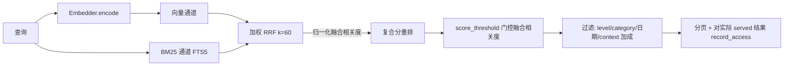
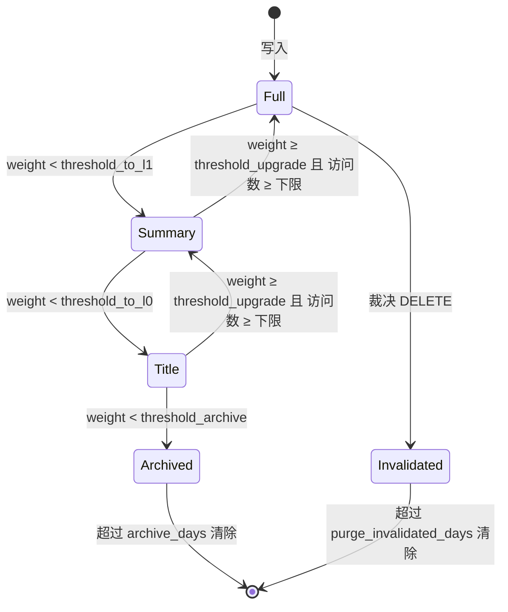
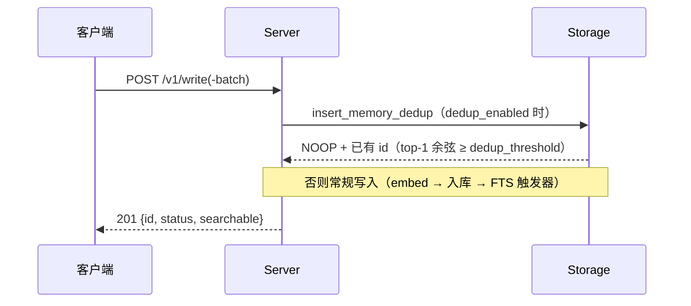
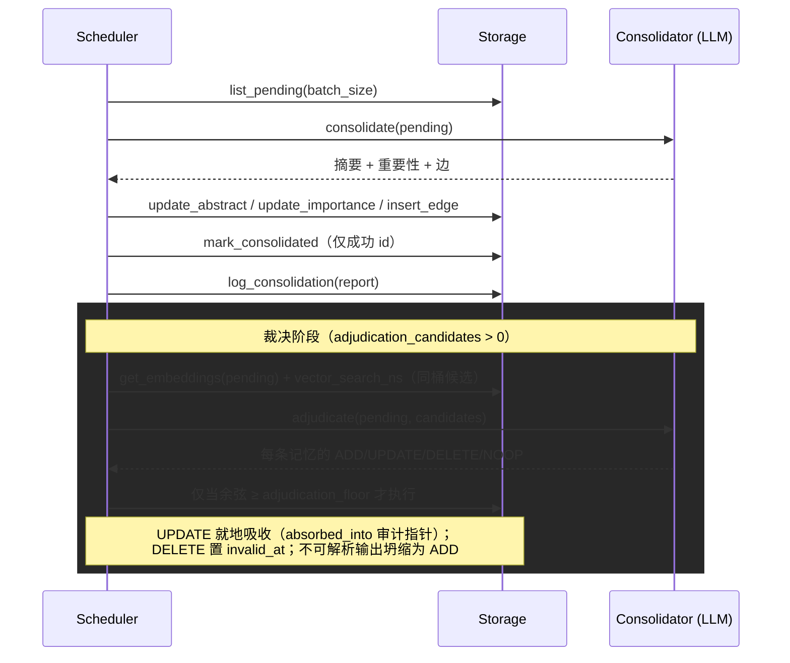

# MerkurDB — 技术架构

> [English](ARCHITECTURE.md)

## Crate 结构与依赖

```
crates/
├── core/                # 类型、trait、错误、融合/打分逻辑 —— 零依赖
├── storage/             # SqliteStorage + LanceDbStorage（feature-gated）
├── embedders/           # NoopEmbedder + OllamaEmbedder + OpenAIEmbedder
├── consolidators/       # NoopConsolidator + LlmConsolidator
├── forgetters/          # EbbinghausForgetter
├── server/              # axum HTTP 服务 + Scheduler（巩固/遗忘 tick）
├── client/              # Rust SDK（MerkurClient trait + HttpMerkurClient）
├── cli/                 # merkurctl 管理 CLI
├── mcp/                 # merkur-mcp：stdio 上的 MCP 服务器
└── eval/                # merkur-eval：LoCoMo + PersonaMem benchmark harness
```

**依赖方向**：所有 crate 依赖 `core`；`server` 组合 storage + 插件；`mcp` 依赖 core/storage/embedders；`eval` 依赖 `client`（经 HTTP 驱动 server）；`cli` 与 `client` 只依赖 `core`（+ HTTP）。

## 插件 Trait 体系

四个 trait，经配置注入，可独立替换：

| Trait | 实现 | 说明 |
|---|---|---|
| `Embedder` | Noop / Ollama / OpenAI 兼容 | 启动时向探针请求自动探测 `dim()`，存储自适应 |
| `Storage` | SqliteStorage / LanceDbStorage | 完整读写面：记忆、边、FTS5 文本搜索、命名空间向量搜索、BFS 扩展、巩固簿记、软失效、`record_access`、批量取向量 |
| `Consolidator` | Noop / LLM（Ollama 或 OpenAI 兼容，可选 bearer + 超时） | `consolidate()` 产出摘要/重要性/边；`adjudicate()` 产出 ADD/UPDATE/DELETE/NOOP 裁决 |
| `Forgetter` | Ebbinghaus | `compute_weight` + `decide`（降级/归档/回升） |

权威定义见 `crates/core/src/traits.rs`；实现插件 = 实现 trait + 在 `config.rs` 加配置 + 在 `main.rs` 接线 + 在 `config.example.yaml` 写文档。

## 数据模型

`Memory`（schema v5）：

| 字段组 | 字段 | 说明 |
|---|---|---|
| 标识 | `id` | 系统生成 |
| 内容 | `content`、`abstract_` | `abstract_` 仅由 Consolidator 写入 |
| 显著性 | `weight`、`importance`、`access_count`、`accessed_at` | `weight` 由遗忘曲线衰减；`importance` 由 Consolidator 评估（客户端不可上报）；访问仅在服务点记账 |
| 分类 | `category`、`level`（Full=2 / Summary=1 / Title=0 / Archived=-1）、`context`、`metadata` | |
| 租户 | `namespace` | 所有检索路径按桶隔离 |
| 时态 | `created_at`、`updated_at`、`valid_at`、`invalid_at` | `valid_at` 从 `created_at` 回填；`invalid_at` 置位 = 软失效（检索不可见，清除前可审计） |
| 巩固 | `pending_consolidation`、`embedding` | |

`Edge`：`source_id`/`target_id`/`weight`/`relation`/`edge_type`（System = LLM 创建，BFS 双向；Manual = 客户端创建，有向）。

## 存储层

### SqliteStorage（默认）
- **元数据**：SQLite，WAL 模式，r2d2 连接池
- **向量索引**：`InMemoryVectorIndex` —— `parking_lot::RwLock`，并行数组 + HashMap，O(n log k) top-k，L2 范数预缓存
- **表**：`memories`、`edges`、`context_tags`、`consolidate_log`、`memories_fts`（FTS5，触发器同步所有写路径）、`merkur_meta`（schema 版本）
- **迁移**：逐版本、事务化、可重放；半成品迁移的库启动时自愈

### LanceDbStorage（feature `lancedb`）
- **元数据**：SQLite（同一套 DDL、同一套迁移）
- **向量**：LanceDB 磁盘存储，超过 256 行自动建 IVF 索引
- **依赖**：`protoc`（仅构建期）、`--features lancedb`

### 共享 SQL 逻辑
`sqlite_helpers.rs` —— 双后端共享行投影（`get_memory_row`）、批量向量获取、BFS、写路径，从结构上杜绝双后端漂移。

## 检索系统

`GET /v1/search` 三种模式：

| 模式 | 路径 | 分数语义 |
|---|---|---|
| `hybrid`（默认） | BM25（FTS5 trigram）+ 向量余弦，各自超采，RRF 融合，复合分重排 | composite = `score_search·fused + score_weight·weight + score_importance·importance` |
| `fast` | 向量 top-k | 原始余弦 |
| `deep` | fast 种子 → CTE BFS 图扩散 | `0.5^depth × 路径权重` |


```mermaid
flowchart LR
    Q[查询] --> E[Embedder.encode]
    E --> V[向量通道]
    Q --> B[BM25 通道 FTS5]
    V --> RRF[加权 RRF k=60]
    B --> RRF
    RRF -->|归一化融合相关度| C[复合分重排]
    C --> TH[score_threshold 门控融合相关度]
    TH --> F[过滤: level/category/日期/context 加成]
    F --> P[分页 + 对实际 served 结果 record_access]
```

融合旋钮位于 `retrieval.fusion.*`（`rrf_k`、通道权重、复合份额）—— 可用 `MERKUR_RETRIEVAL__FUSION__*` 环境变量覆盖。

**访问信号纪律**：检索方法全部纯读（无副作用）；`record_access` 仅由服务点（search handler、`/v1/context`、MCP `search_memory`）对实际 served 的结果调用。

## 认知管线

### 生命周期


```mermaid
stateDiagram-v2
    [*] --> Full: 写入
    Full --> Summary: weight < threshold_to_l1
    Summary --> Title: weight < threshold_to_l0
    Title --> Archived: weight < threshold_archive
    Summary --> Full: weight ≥ threshold_upgrade 且 访问数 ≥ 下限
    Title --> Summary: weight ≥ threshold_upgrade 且 访问数 ≥ 下限
    Archived --> [*]: 超过 archive_days 清除
    Full --> Invalidated: 裁决 DELETE
    Invalidated --> [*]: 超过 purge_invalidated_days 清除
```

- 权重：`w(t) = w₀ · exp(-Δt·ln2/h) · min(1 + β·log₂(1+n), 3.0)` —— `h = half_life_seconds`，`β = access_boost`，`n = access_count`
- 回升带滞回门（`threshold_upgrade` 必须高于 `threshold_to_l1`；权重与访问数双门槛），热点记忆可爬回且不振荡
- 软失效（`invalid_at`）是系统专属移除通道；客户端 `DELETE` 仍是立即硬删

### 写路径


```mermaid
sequenceDiagram
    participant C as 客户端
    participant S as Server
    participant D as Storage

    C->>S: POST /v1/write(-batch)
    S->>D: insert_memory_dedup（dedup_enabled 时）
    D-->>S: NOOP + 已有 id（top-1 余弦 ≥ dedup_threshold）
    Note over S,D: 否则常规写入（embed → 入库 → FTS 触发器）
    S-->>C: 201 {id, status, searchable}
```

去重探测为纯读（不污染访问信号）；探测失败时回退为常规插入。

### 巩固 tick


```mermaid
sequenceDiagram
    participant S as Scheduler
    participant D as Storage
    participant L as Consolidator (LLM)

    S->>D: list_pending(batch_size)
    S->>L: consolidate(pending)
    L-->>S: 摘要 + 重要性 + 边
    S->>D: update_abstract / update_importance / insert_edge
    S->>D: mark_consolidated（仅成功 id）
    S->>D: log_consolidation(report)
    rect rgb(40, 40, 40)
        Note over S,L: 裁决阶段（adjudication_candidates > 0）
        S->>D: get_embeddings(pending) + vector_search_ns（同桶候选）
        S->>L: adjudicate(pending, candidates)
        L-->>S: 每条记忆的 ADD/UPDATE/DELETE/NOOP
        S->>D: 仅当余弦 ≥ adjudication_floor 才执行
        Note over S,D: UPDATE 就地吸收（absorbed_into 审计指针）；<br/>DELETE 置 invalid_at；不可解析输出坍缩为 ADD
    end
```

## 配置

优先级：`--config YAML` > `MERKUR_*` 环境变量（`__` 分层）> 内建默认值。启动校验拒绝矛盾或越界配置（阈值序、dedup/fusion 区间、保留键）。

完整带注释示例见 [`config.example.yaml`](../config.example.yaml)。配置段：`server`（host/port/cors/dev_mode）· `storage`（sqlite/lancedb）· `plugins.embedder`（noop/ollama/openai）· `plugins.consolidator`（noop/llm + backend/api_key/timeout_seconds）· `retrieval`（限额、阈值、`fusion.*`）· `auth`（tokens/disabled）· `consolidation`（interval/batch/adjudication_floor/candidates）· `forgetting`（衰减/阈值/回升/清除窗口）· `write`（dedup）· `logging` · `rate_limit`。

## API 面

`/v1` 下 16 条路由（契约以 [`openapi.yaml`](../openapi.yaml) 为准）：

- 公开：`GET /health`、`GET /metrics`（Prometheus）
- 写入：`POST /write`、`POST /write-batch`
- 读取：`GET /search`、`POST /context`、`GET /memory/{id}`、`GET /graph/{id}`、`GET /status`
- 生命周期：`POST /consolidate`、`GET /consolidate/log`、`POST /forget`
- 图：`POST /relate`、`POST /relate-batch`

认证：`Authorization: Bearer <token>`（恒定时间比较）；`X-Merkur-Namespace` 将写入/搜索/context/图限定到单桶（逻辑隔离，非安全边界）。错误信封：`{"error": {"code", "message"}}`；常见错误码 —— 401 UNAUTHORIZED、429 RATE_LIMITED、502 EMBED_FAILED、write-batch 全失败返回 207。

## Feature Gates

| Feature | 依赖 | 效果 |
|---------|------|------|
| `ollama`（默认） | reqwest | OllamaEmbedder |
| `openai` | reqwest | OpenAIEmbedder（+ consolidator OpenAI 后端） |
| `lancedb` | lancedb + arrow + protoc | LanceDbStorage |

## 技术栈

| 层 | 选择 | 理由 |
|----|------|------|
| HTTP | axum 0.8 | Tokio 生态，异步 |
| SQLite | rusqlite（bundled） | 零系统依赖 |
| 向量 | 内存索引；LanceDB feature | <10K 向量够用；之上走磁盘 + IVF |
| 序列化 | serde + serde_json | Rust 标准 |
| 配置 | figment | YAML + env 分层合并 |
| 日志 | tracing | 结构化 |
| 错误 | thiserror | derive 宏 |
| 部署 | 单二进制 + Docker | 零运行时依赖 |
