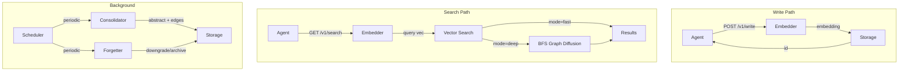
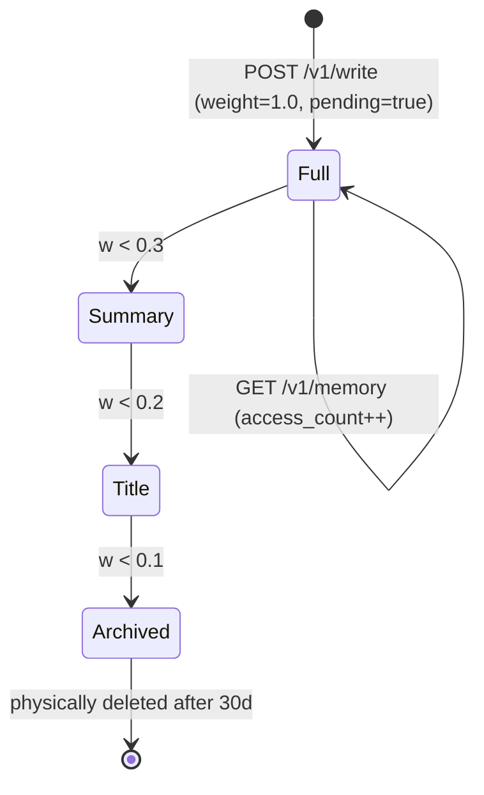

# MerkurDB — Design Spec

> [中文版](SPEC_CN.md) · v1.0

## 1. Positioning

MerkurDB is a **standalone, cognitive-science-inspired memory service** for AI agents.

What sets it apart from existing solutions:

| | Industry | MerkurDB |
|--|----------|----------|
| Philosophy | Engineering-driven — store more, search better | **Cognition-driven — how the brain remembers** |
| Forgetting | Treated as a bug | **First-class citizen — strategic forgetting beats remembering everything** |
| Consolidation | Write-and-done, no offline processing | **Core mechanism — offline summarization, entity extraction, graph building** |
| Retrieval | Single mode (vector top-k) | **Dual system — S1 fast + S2 deep** |
| Architecture | Mostly embedded in agent frameworks | **Standalone service, framework-agnostic** |
| Deployment | Python stack, complex deps | **Single Rust binary, zero runtime deps** |

## 2. Background

### 2.1 Systemic Gaps in Existing Solutions

Analysis of Zep, Memobase, GraphRAG, Letta, OpenViking, and others:

| Gap | Description | Industry Status |
|-----|-------------|-----------------|
| No consolidation | Write-and-done, no offline compression/reasoning | **No one does this** |
| No forgetting strategy | Store everything or coarse window truncation | **No one does this** |
| No dual retrieval | Vector top-k only, no fast/slow separation | **No one does this** |
| No context awareness | Retrieval ignores encoding-time context | Only Zep has temporal |
| Embedded architecture | Memory bound to agent framework, not swappable | Partially decoupled |

### 2.2 Cognitive Science Foundations

Each mechanism maps to a known model of human memory:

| Mechanism | Cognitive Basis | Implementation |
|-----------|----------------|----------------|
| Ebbinghaus forgetting curve | Memory strength decays exponentially; repeated access strengthens | `Forgetter` trait |
| Memory consolidation | Hippocampus→cortex transfer, offline reorganization | `Consolidator` trait |
| Dual-process theory | Kahneman System 1 (fast) / System 2 (slow) | S1 Fast / S2 Deep |
| Hierarchical degradation | Full → Gist → Title → Forgotten | `MemoryLevel` enum |
| Context-dependent memory | Encoding-time context affects retrieval | Context tags + soft filtering |

## 3. Design Principles

- **Standalone first** — Independent HTTP service, not embedded in any agent framework
- **Cognition-driven** — Every mechanism corresponds to a known human memory model
- **Pluggable modules** — Each layer is replaceable (trait + config injection), no vendor lock-in
- **Forgetting is a feature** — Strategic forgetting beats remembering everything
- **Zero-dependency deployment** — Single Rust binary, runs bare-metal or in Docker

## 4. Data Flow



## 5. Memory Lifecycle



```
w(t) = w₀ · exp(-Δt · ln2 / h) · min(1 + β · log₂(1+n), 3.0)

Full (L2)    w < 0.3 → Summary (L1)
Summary (L1) w < 0.2 → Title (L0)
Title (L0)   w < 0.1 → Archive (L-1)
Archive               → physically deleted after 30 days
```

## 6. Configuration-Driven

All plugins selected at startup via config — replaceable without recompilation:

```yaml
plugins:
  embedder:
    type: "ollama"          # ollama | openai | noop
  consolidator:
    type: "noop"            # noop | llm (LLM requires external API)
  forgetter:
    type: "ebbinghaus"      # ebbinghaus | noop
  storage:
    type: "sqlite"          # sqlite | lancedb
```

## 7. SDK Strategy

**Hybrid approach**: Rust trait (reference impl) + OpenAPI 3.0 spec (multi-language codegen)

- MerkurDB maintains the `merkur-client` crate (`MerkurClient` trait + `HttpMerkurClient`)
- `openapi.yaml` for openapi-generator: Python, TypeScript, Go, etc.
- Third parties can integrate via REST API directly

```rust
// Rust usage
let client = HttpMerkurClient::new("http://localhost:1934");
let resp = client.write("hello world", None).await?;
let results = client.search("hello", Some("fast"), Some(10), None).await?;
```

## 8. Phased Roadmap

### Phase 0 — Complete
- Project scaffold + type system + SQLite storage + Ollama/Noop embedder
- HTTP server (write, search, memory CRUD, status)
- 21 integration tests

### Phase 1 — Complete
- S2 Deep Search (CTE BFS)
- Ebbinghaus forgetting curve
- LlmConsolidator
- Background Scheduler (consolidate + forget)
- Manual trigger endpoints

### Phase 2 — Complete
- LanceDB storage backend (feature gated)
- OpenAI embedder (feature gated)
- Rust SDK (`merkur-client` crate)
- Consolidation audit log, graph endpoint, search filters
- Docker + CI/CD

### Phase 3 — Planned
- gRPC API (tonic)
- PostgreSQL backend
- MCP adapter (Agent protocol integration)
- Distributed consolidation
- Web UI dashboard
- Multi-modal support (image embeddings)
- At-rest encryption
- Rate limiting

## 9. Language Choice

**Rust all-in** rationale:

| Factor | Rationale |
|--------|-----------|
| Deployment | Single 8MB binary, zero runtime deps (no Python/Node) |
| Concurrency | tokio async, no GIL, compile-time safety |
| Safety | Compile-time memory safety, fewer production incidents |
| Embedding | External API calls (Ollama/OpenAI) — industry standard |
| Dev cost | 2-3x slower than Python, but MerkurDB scope is ~4,500 lines |
| AI ecosystem | Mitigated by external API calls |

## 10. License

MIT
