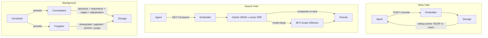
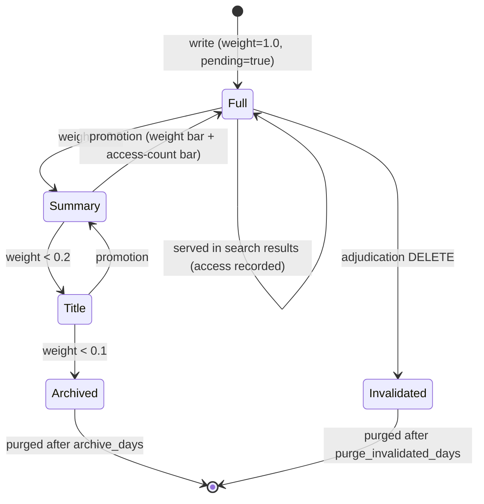

# MerkurDB — Design Spec

> [中文版](SPEC_CN.md)

## 1. Positioning

MerkurDB is a **standalone, cognitive-science-inspired memory service** for AI agents.

| | Industry | MerkurDB |
|--|----------|----------|
| Philosophy | Engineering-driven — store more, search better | **Cognition-driven — how the brain remembers** |
| Forgetting | Treated as a bug | **First-class citizen — decay, cascade downgrade, hysteresis-gated promotion** |
| Write governance | Append-only or blind overwrite | **Dedup NOOP at write time + async LLM adjudication (absorb/invalidate) with a dual-signal gate** |
| Retrieval | Single mode (vector top-k) | **Hybrid default — BM25 × vector RRF fusion + composite re-rank; fast/deep as opt-outs** |
| Evaluation | Vendor-reported numbers | **Open harness with per-question dumps (LoCoMo + PersonaMem), fully reproducible** |
| Deployment | Python stack, complex deps | **Single Rust binary, zero runtime deps** |

## 2. Background

### 2.1 Cognitive Science Foundations

Each mechanism maps to a known model of human memory:

| Mechanism | Cognitive Basis | Implementation |
|-----------|----------------|----------------|
| Ebbinghaus forgetting curve | Memory strength decays exponentially; repeated access strengthens | `Forgetter` trait |
| Memory consolidation | Hippocampus→cortex transfer, offline reorganization | `Consolidator` trait (abstracts, importance, edges, adjudication) |
| Dual-process theory | Kahneman System 1 (fast) / System 2 (slow) | `fast` (vector) / `deep` (BFS) modes, `hybrid` as the default blend |
| Hierarchical degradation | Full → Gist → Title → Forgotten | `MemoryLevel` enum |
| Context-dependent memory | Encoding-time context affects retrieval | Context tags + boost |
| Source monitoring | Knowing *when* a fact held | `valid_at`/`invalid_at` soft-invalidation |

### 2.2 Design Principles

- **Standalone first** — Independent HTTP service, not embedded in any agent framework
- **Cognition-driven** — Every mechanism corresponds to a known human memory model
- **Pluggable modules** — Each layer is replaceable (trait + config injection), no vendor lock-in
- **Forgetting is a feature** — Strategic forgetting beats remembering everything
- **Zero-dependency deployment** — Single Rust binary, runs bare-metal or in Docker
- **Measure, then tune** — retrieval and governance parameters ship with benchmark-validated defaults, not vibes

## 3. Data Flow


```mermaid
flowchart TB
    subgraph Write Path
        A[Agent] -->|POST /v1/write| E[Embedder]
        E --> S[Storage]
        S -->|dedup probe: NOOP or insert| A
    end

    subgraph Search Path
        A2[Agent] -->|GET /v1/search| E2[Embedder]
        E2 --> H[Hybrid: BM25 x vector RRF]
        H -->|composite re-rank| R[Results]
        H -->|mode=deep| BFS[BFS Graph Diffusion]
        BFS --> R
    end

    subgraph Background
        SCH[Scheduler] -->|periodic| CON[Consolidator]
        CON -->|abstracts + importance + edges + adjudication| S2[Storage]
        SCH -->|periodic| FOR[Forgetter]
        FOR -->|downgrade / upgrade / archive / purge| S2
    end
```

## 4. Memory Lifecycle


```mermaid
stateDiagram-v2
    [*] --> Full: write (weight=1.0, pending=true)
    Full --> Full: consolidate (abstract + importance + edges)
    Full --> Full: served in search results (access recorded)
    Full --> Summary: weight < 0.3
    Summary --> Title: weight < 0.2
    Title --> Archived: weight < 0.1
    Summary --> Full: promotion (weight bar + access-count bar)
    Title --> Summary: promotion
    Archived --> [*]: purged after archive_days
    Full --> Invalidated: adjudication DELETE
    Invalidated --> [*]: purged after purge_invalidated_days
```

```
w(t) = w₀ · exp(-Δt · ln2 / h) · min(1 + β · log₂(1+n), 3.0)
```

Access is recorded at serving points only (search results actually served, context assembly, MCP search) — pure retrieval internals never touch the signal, so promotion reflects demonstrated demand.

## 5. Configuration-Driven

All plugins selected at startup via config — replaceable without recompilation:

```yaml
plugins:
  embedder:
    type: "ollama"          # ollama | openai | noop
  consolidator:
    type: "noop"            # noop | llm
storage:
  type: "sqlite"            # sqlite | lancedb
```

Retrieval fusion (`retrieval.fusion.*`), write governance (`write.*`, `consolidation.adjudication_*`), and lifecycle thresholds (`forgetting.*`) are all config knobs with startup validation.

## 6. SDK Strategy

**Hybrid approach**: Rust trait (reference impl) + OpenAPI 3.0 spec (multi-language codegen)

- `merkur-client` crate (`MerkurClient` trait + `HttpMerkurClient`, optional `with_namespace` scoping)
- `openapi.yaml` for openapi-generator: Python, TypeScript, Go, etc.
- Third parties can integrate via REST API directly

```rust
// Rust usage
let client = HttpMerkurClient::with_token("http://localhost:1934", token)?
    .with_namespace("my-agent");
let resp = client.write("hello world", None, None).await?;
let results = client.search("hello", &SearchParams::default()).await?;
```

## 7. Roadmap

| Priority | Feature |
|----------|---------|
| P2 | At-rest encryption (SQLCipher or app-layer) |
| P2 | PostgreSQL backend via the Storage trait |
| P3 | Multi-modal (image embeddings) |

Per-release history lives in [CHANGELOG.md](../CHANGELOG.md); benchmark numbers live in the README's Evaluation section.

## 8. Language Choice

**Rust all-in** rationale:

| Factor | Rationale |
|--------|-----------|
| Deployment | Single small binary, zero runtime deps (no Python/Node) |
| Concurrency | tokio async, no GIL, compile-time safety |
| Safety | Compile-time memory safety, fewer production incidents |
| Embedding | External API calls (Ollama/OpenAI) — industry standard |
| AI ecosystem | Mitigated by external API calls |

## 9. License

MIT
