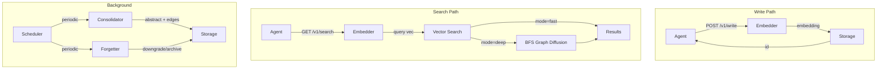
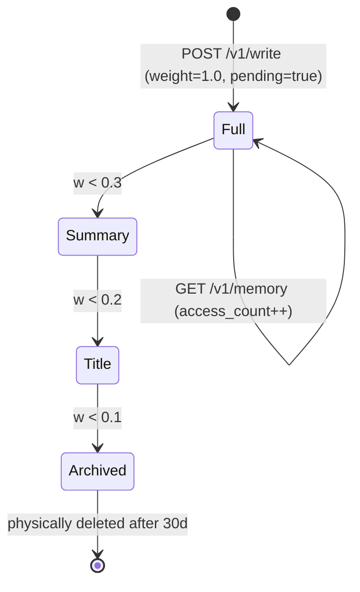

# MerkurDB — 设计规范

> [English](SPEC.md) · v0.3.0

## 1. 定位

MerkurDB 是面向 AI Agent 的**独立认知记忆服务**，灵感源自神经科学。

与现有方案的差异：

| | 行业现状 | MerkurDB |
|--|----------|----------|
| 理念 | 工程驱动 — 存更多、搜更快 | **认知驱动 — 模拟大脑的记忆方式** |
| 遗忘 | 视为 bug | **一等公民 — 策略性遗忘优于记住一切** |
| 巩固 | 写即结束，无离线处理 | **核心机制 — 离线摘要、实体提取、图构建** |
| 检索 | 单一模式（向量 top-k） | **双系统 — S1 快 + S2 深** |
| 架构 | 多嵌入在 Agent 框架中 | **独立服务，框架无关** |
| 部署 | Python 栈，依赖复杂 | **单个 Rust 二进制，零运行时依赖** |

## 2. 背景

### 2.1 现有方案的系统性缺陷

对 Zep、Memobase、GraphRAG、Letta、OpenViking 等的分析：

| 缺陷 | 描述 | 行业状态 |
|------|------|----------|
| 无巩固 | 写即结束，无离线压缩/推理 | **无人实现** |
| 无遗忘策略 | 全量存储或粗粒度窗口截断 | **无人实现** |
| 无双路检索 | 仅向量 top-k，无快/慢分离 | **无人实现** |
| 无上下文感知 | 检索忽略编码时上下文 | 仅 Zep 有时序 |
| 嵌入式架构 | 记忆绑定在 Agent 框架中，不可替换 | 部分解耦 |

### 2.2 认知科学基础

每个机制对应一个已知的人类记忆模型：

| 机制 | 认知基础 | 实现 |
|------|----------|------|
| 艾宾浩斯遗忘曲线 | 记忆强度指数衰减；重复访问增强 | `Forgetter` trait |
| 记忆巩固 | 海马体→皮层转移，离线重组 | `Consolidator` trait |
| 双过程理论 | Kahneman 系统 1（快）/ 系统 2（慢） | S1 Fast / S2 Deep |
| 层级退化 | 完整 → 摘要 → 标题 → 遗忘 | `MemoryLevel` enum |
| 上下文依赖记忆 | 编码时上下文影响检索 | Context tags + 软过滤 |

## 3. 设计原则

- **独立优先** — 独立 HTTP 服务，不嵌入任何 Agent 框架
- **认知驱动** — 每个机制对应一个已知的人类记忆模型
- **可插拔模块** — 每层可替换（trait + 配置注入），无厂商锁定
- **遗忘是特性** — 策略性遗忘优于记住一切
- **零依赖部署** — 单个 Rust 二进制，裸机或 Docker 运行

## 4. 数据流



## 5. 记忆生命周期



```
w(t) = w₀ · exp(-Δt · ln2 / h) · min(1 + β · log₂(1+n), 3.0)

Full (L2)    w < 0.3 → Summary (L1)
Summary (L1) w < 0.2 → Title (L0)
Title (L0)   w < 0.1 → Archive (L-1)
Archive               → 30 天后物理删除
```

## 6. 配置驱动

所有插件通过配置选择，无需重新编译即可替换：

```yaml
plugins:
  embedder:
    type: "ollama"          # ollama | openai | noop
  consolidator:
    type: "noop"            # noop | llm（LLM 需要外部 API）
  forgetter:
    type: "ebbinghaus"      # ebbinghaus | noop
  storage:
    type: "sqlite"          # sqlite | lancedb
```

## 7. SDK 策略

**混合方案**：Rust trait（参考实现）+ OpenAPI 3.0 spec（多语言代码生成）

- MerkurDB 维护 `merkur-client` crate（`MerkurClient` trait + `HttpMerkurClient`）
- `openapi.yaml` 供 openapi-generator 使用：Python、TypeScript、Go 等
- 第三方可直接通过 REST API 集成

```rust
// Rust 用法
let client = HttpMerkurClient::new("http://localhost:1934");
let resp = client.write("hello world", None).await?;
let results = client.search("hello", Some("fast"), Some(10), None).await?;
```

## 8. 阶段路线

### Phase 0 — 已完成
- 项目脚手架 + 类型系统 + SQLite 存储 + Ollama/Noop 嵌入器
- HTTP 服务（write、search、memory CRUD、status）
- 21 个集成测试

### Phase 1 — 已完成
- S2 深度搜索（CTE BFS）
- 艾宾浩斯遗忘曲线
- LlmConsolidator
- 后台 Scheduler（巩固 + 遗忘）
- 手动触发端点

### Phase 2 — 已完成
- LanceDB 存储后端（feature gate）
- OpenAI 嵌入器（feature gate）
- Rust SDK（`merkur-client` crate）
- 巩固审计日志、图端点、搜索过滤器
- Docker + CI/CD

### Phase 3 — 规划中
- gRPC API（tonic）
- PostgreSQL 后端
- MCP adapter（Agent 协议集成）
- 分布式巩固
- Web UI 仪表盘
- 多模态支持（图像嵌入）
- 静态加密
- 请求限流

## 9. 语言选择

**全栈 Rust** 理由：

| 因素 | 理由 |
|------|------|
| 部署 | 单个 8MB 二进制，零运行时依赖（无 Python/Node） |
| 并发 | tokio 异步，无 GIL，编译期安全 |
| 安全 | 编译期内存安全，更少生产事故 |
| 嵌入 | 外部 API 调用（Ollama/OpenAI）— 行业标准 |
| 开发成本 | 比 Python 慢 2-3 倍，但 MerkurDB 规模仅 ~6,400 行 |
| AI 生态 | 通过外部 API 调用缓解 |

## 10. 许可证

MIT
