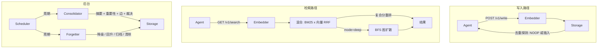
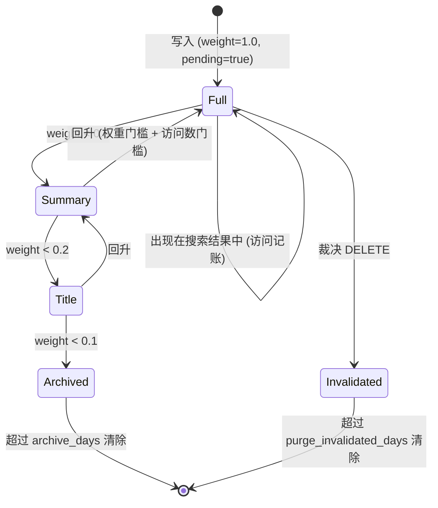

# MerkurDB — 设计规范

> [English](SPEC.md)

## 1. 定位

MerkurDB 是一个**独立的、受认知科学启发的记忆服务**，面向 AI Agent。

| | 业界 | MerkurDB |
|--|------|----------|
| 哲学 | 工程驱动 —— 存得更多、搜得更准 | **认知驱动 —— 人脑如何记忆** |
| 遗忘 | 被视为缺陷 | **一等公民 —— 衰减、级联降级、滞回回升** |
| 写时治理 | 只追加或盲目覆盖 | **写时去重 NOOP + 异步 LLM 裁决（吸收/失效）+ 双信号门** |
| 检索 | 单一模式（向量 top-k） | **hybrid 默认 —— BM25 × 向量 RRF 融合 + 复合分重排；fast/deep 为可选项** |
| 评测 | 厂商自报数字 | **开放 harness + 逐题明细 dump（LoCoMo + PersonaMem），完全可复现** |
| 部署 | Python 技术栈，依赖复杂 | **单一 Rust 二进制，零运行时依赖** |

## 2. 背景

### 2.1 认知科学基础

每个机制对应一个已知的人类记忆模型：

| 机制 | 认知基础 | 实现 |
|------|----------|------|
| 艾宾浩斯遗忘曲线 | 记忆强度指数衰减；重复访问强化 | `Forgetter` trait |
| 记忆巩固 | 海马体→皮层转移，离线重组 | `Consolidator` trait（摘要、重要性、建边、裁决） |
| 双过程理论 | Kahneman 系统 1（快）/ 系统 2（慢） | `fast`（向量）/ `deep`（BFS）模式，`hybrid` 为默认融合 |
| 层级降解 | 全文 → 摘要 → 标题 → 遗忘 | `MemoryLevel` 枚举 |
| 情境依赖记忆 | 编码时的情境影响提取 | context 标签 + 加成 |
| 来源监控 | 知道事实"何时成立" | `valid_at`/`invalid_at` 软失效 |

### 2.2 设计原则

- **独立服务优先** —— 独立 HTTP 服务，不内嵌于任何 agent 框架
- **认知驱动** —— 每个机制对应一个已知的人类记忆模型
- **插件化模块** —— 每一层可替换（trait + 配置注入），无供应商锁定
- **遗忘是特性** —— 有策略的遗忘胜过全量记忆
- **零依赖部署** —— 单一 Rust 二进制，裸机或 Docker 均可运行
- **先测量，后调优** —— 检索与治理参数的出厂默认值经过公开 benchmark 验证，而不是拍脑袋

## 3. 数据流


```mermaid
flowchart TB
    subgraph 写入路径
        A[Agent] -->|POST /v1/write| E[Embedder]
        E --> S[Storage]
        S -->|去重探测: NOOP 或插入| A
    end

    subgraph 检索路径
        A2[Agent] -->|GET /v1/search| E2[Embedder]
        E2 --> H[混合: BM25 x 向量 RRF]
        H -->|复合分重排| R[结果]
        H -->|mode=deep| BFS[BFS 图扩散]
        BFS --> R
    end

    subgraph 后台
        SCH[Scheduler] -->|周期| CON[Consolidator]
        CON -->|摘要 + 重要性 + 边 + 裁决| S2[Storage]
        SCH -->|周期| FOR[Forgetter]
        FOR -->|降级 / 回升 / 归档 / 清除| S2
    end
```

## 4. 记忆生命周期


```mermaid
stateDiagram-v2
    [*] --> Full: 写入 (weight=1.0, pending=true)
    Full --> Full: 巩固 (摘要 + 重要性 + 边)
    Full --> Full: 出现在搜索结果中 (访问记账)
    Full --> Summary: weight < 0.3
    Summary --> Title: weight < 0.2
    Title --> Archived: weight < 0.1
    Summary --> Full: 回升 (权重门槛 + 访问数门槛)
    Title --> Summary: 回升
    Archived --> [*]: 超过 archive_days 清除
    Full --> Invalidated: 裁决 DELETE
    Invalidated --> [*]: 超过 purge_invalidated_days 清除
```

```
w(t) = w₀ · exp(-Δt · ln2 / h) · min(1 + β · log₂(1+n), 3.0)
```

访问仅在实际服务的返回点记账（搜索结果被 served、上下文装配、MCP 搜索）—— 纯检索内部绝不触碰信号，回升反映的是真实需求。

## 5. 配置驱动

所有插件在启动时经配置选择 —— 无需重新编译即可替换：

```yaml
plugins:
  embedder:
    type: "ollama"          # ollama | openai | noop
  consolidator:
    type: "noop"            # noop | llm
storage:
  type: "sqlite"            # sqlite | lancedb
```

检索融合（`retrieval.fusion.*`）、写时治理（`write.*`、`consolidation.adjudication_*`）、生命周期阈值（`forgetting.*`）均为配置旋钮，启动时校验。

## 6. SDK 策略

**混合路线**：Rust trait（参考实现）+ OpenAPI 3.0 规范（多语言代码生成）

- `merkur-client` crate（`MerkurClient` trait + `HttpMerkurClient`，可选 `with_namespace` 桶限定）
- `openapi.yaml` 供 openapi-generator 生成 Python、TypeScript、Go 等客户端
- 第三方可直接经 REST API 集成

```rust
// Rust 用法
let client = HttpMerkurClient::with_token("http://localhost:1934", token)?
    .with_namespace("my-agent");
let resp = client.write("hello world", None, None).await?;
let results = client.search("hello", &SearchParams::default()).await?;
```

## 7. 路线图

| 优先级 | 特性 |
|--------|------|
| P2 | 静态加密（SQLCipher 或应用层） |
| P2 | PostgreSQL 后端（经 Storage trait） |
| P3 | 多模态（图像嵌入） |

各版本历史见 [CHANGELOG.md](../CHANGELOG.md)；benchmark 数字见 README 的评测章节。

## 8. 语言选择

**全 Rust** 的理由：

| 因素 | 理由 |
|------|------|
| 部署 | 单一小型二进制，零运行时依赖（无 Python/Node） |
| 并发 | tokio 异步，无 GIL，编译期安全 |
| 安全 | 编译期内存安全，线上事故更少 |
| 嵌入 | 外部 API 调用（Ollama/OpenAI）—— 业界标准做法 |
| AI 生态 | 由外部 API 调用弥补 |

## 9. 许可证

MIT
